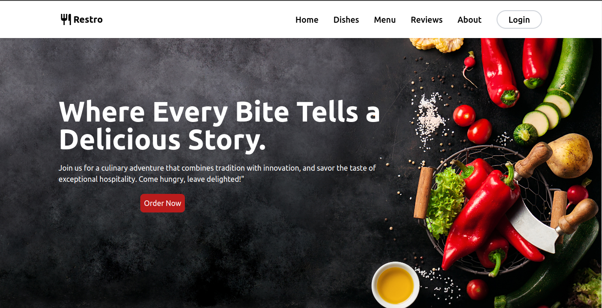
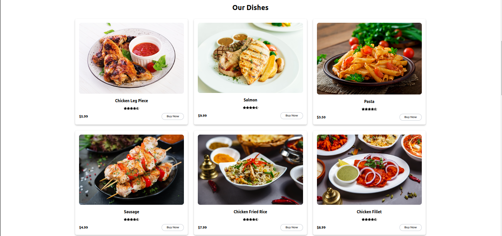
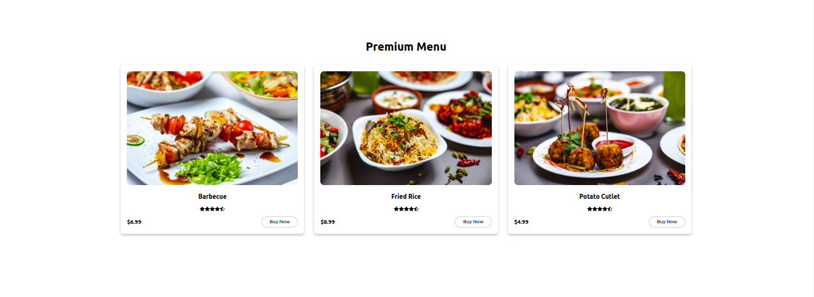
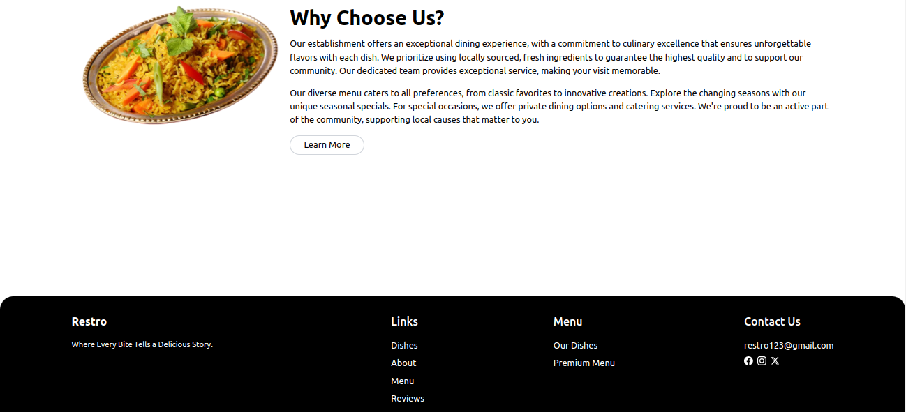

# Project Name

Restro

## Table of Contents

1. [Introduction](#introduction)
2. [Screenshots](#screenshots)
3. [Demo](#demo)
4. [Installation](#installation)


## Introduction

Landing Page of a Restaurant Website

## Screenshots

Welcome to my awesome project. Here are some screenshots to give you a glimpse of what it looks like:











## Demo

This is the link to a live demo of this project (if applicable). This is hosted in netlify platform.

[Live Demo](https://restroweb123.netlify.app/)

## Installation

Here is the detailed process of how you can install this design in your machine.

```bash
# Clone the repository
git clone https://github.com/sumanbalayar08/restaurant_website.git

# Navigate to the project directory
cd restaurant_website

# Install dependencies
npm install

# Start the development server
npm start